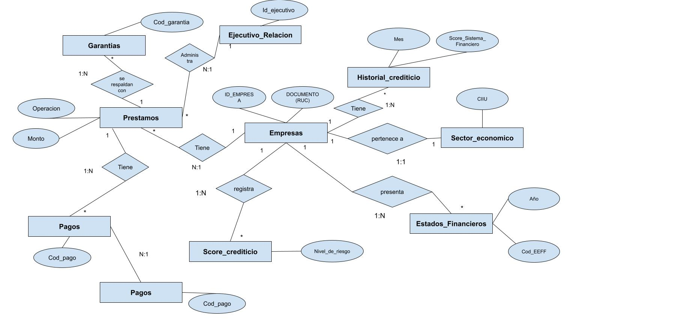

# Proyecto Final: Score Crediticio para Empresas
Integrantes : Bremel Arones Rea / Patricia Lahura Albujar

Docente: Ing. Kevin Rivera Vergaray

## **1. Iniciación: Definición de los objetivos y el alcance inicial de la base de datos.**
### Título del Problema:  Score Crediticio para Empresas
### **Descripción del Problema:**
En los últimos años, una entidad bancaria ha experimentado un aumento significativo en la tasa de morosidad de sus préstamos comerciales. Este incremento ha generado pérdidas financieras y ha afectado negativamente la liquidez del banco. Se requiere asignar un score crediticio para fortalecer el proceso de evaluación de préstamos.

### **Tablas y Campos Relevantes:**

- Empresas: Se registran los datos de identificación de las empresas y sector al cual perteneces.
- Sector: Se registra la equivalencia del código SIC con el sector económico al cual se hace referencia. 
- Ejecutivo de relación: Se registran los datos del ejecutivo de la entidad a cargo de la cuenta. 
- Préstamos: Se registran los datos asociados al préstamo como monto, fecha de vencimiento, entre otros. 
- Garantías: Se registran los datos de las garantías que cubren el préstamo.
- Historial Crediticio Externo: Se registran los datos del desempeño de la empresa en el Sistema Financiero. 
- Estados Financieros: Se registran los datos principales de la situación financiera de la empresa. 
- Score: Se registran los datos del cálculo del Score con el nivel de riesgo de la empresa. 
- Cuotas: Se registran los datos de las cuotas que tiene que pagar el cliente por sus obligaciones contraídas con la entidad. 
- Pagos: Se registran los datos de las amortizaciones des las cuotas y la fecha de amortización. 

### **Beneficios Esperados:**
- Mejorar la calidad de préstamos otorgados a clientes antiguos y nuevos. 
- Asegurar el cumplimiento de pagos de los clientes.
- Identificar sectores de alto riesgo relacionados al riesgo de clientes.

## **2. Análisis: Diseño Conceptual de la base de datos.**

En esta etapa se procedió con la creación de las entidades a considerar con sus distintas relaciones entre ellas así como la llave principal para la identificación única de cada registro.

.

